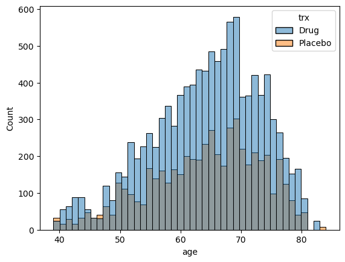

# Hypothesis Testing in Healthcare: Drug Safety

A pharmaceutical company GlobalXYZ has just completed a randomized controlled drug trial. To promote transparency and reproducibility of the drug's outcome, they (GlobalXYZ) have presented the dataset to your organization, a non-profit that focuses primarily on drug safety.

The dataset `drug_safety.csv` was obtained from [Hbiostat](https://hbiostat.org/data/) courtesy of the Vanderbilt University Department of Biostatistics. It contained five adverse effects: headache, abdominal pain, dyspepsia, upper respiratory infection, chronic obstructive airway disease (COAD), demographic data, vital signs, lab measures, etc. The ratio of drug observations to placebo observations is 2 to 1.

For this project, the dataset has been modified to reflect the presence and absence of adverse effects `adverse_effects` and the number of adverse effects in a single individual `num_effects`.

The columns in the modified dataset are: 

| Column | Description |
|--------|-------------|
|`sex` | The gender of the individual |
|`age` | The age of the individual |
|`week` | The week of the drug testing |
|`trx` | The treatment (Drug) and control (Placebo) groups | 
|`wbc` | The count of white blood cells |
|`rbc` | The count of red blood cells |
|`adverse_effects` | The presence of at least a single adverse effect |
|`num_effects` | The number of adverse effects experienced by a single individual |

The original dataset can be found [here](https://hbiostat.org/data/repo/safety.rda).

## Table of Contents
- [Insights](#insights)
- [Data Analysis](#data-analysis)
- [Import libraries](#import-libraries)
- [Load the Dataset](#load-the-dataset)
- [Count the adverse effect column values for each trx group](#count-the-adverse_effect-column-values-for-each-trx-group)
- [Compute Total Rows in Each Group](#compute-total-rows-in-each-group)
- [Create an Array of the "Yes" Counts for Each Group](#create-an-array-of-the-yes-counts-for-each-group)
- [Create an Array of the Total Number of Rows in Each Group](#create-an-array-of-the-total-number-of-rows-in-each-group)
- [Perform a Two-sided Z-test on the Two Proportions](#perform-a-two-sided-z-test-on-the-two-proportions)
- [Store the p-value](#store-the-p-value)
- [Determine if num_effects and trx are Independent](#determine-if-num_effects-and-trx-are-independent)
- [Extract the p-value](#extract-the-p-value)
- [Create a Histogram with Seaborn](#create-a-histogram-with-seaborn)
- [Confirm the Histogram Output by Conducting a Normality Test](#confirm-the-histogram-output-by-conducting-a-normality-test,-to-choose-between-unpaired-t-test-and-wilcoxon-mann-whitney-test)
- [Select the Age of the Drug Group](#select-the-age-of-the-drug-group)
- [Select the Age of the Placebo Group](#select-the-age-of-the-placebo-group)
- [Since the Data Distribution is Not Normal, Conduct a Two-sided Mann-Whitney U Test](#since-the-data-distribution-is-not-normal-conduct-a-two-sided-mann-whitney-u-test)
- [Extract the p-value](#extract-the-p-value)

## Insights
### Introduction
The pharmaceutical company GlobalXYZ has recently concluded a randomized controlled drug trial, presenting the dataset drug_safety.csv to a non-profit organization specializing in drug safety. The trial, with a 2:1 ratio of drug to placebo observations, encompasses data on adverse effects, demographic information, and various health metrics. The objective is to conduct rigorous hypothesis testing to ensure transparency and reproducibility of the drug's outcomes.

### Adverse Effects Analysis
The dataset reveals insightful information about adverse effects (`adverse_effects`) and the count of adverse effects per individual (`num_effects`). The proportions of adverse effects in the drug and placebo groups are meticulously examined, utilizing statistical tests such as the two-sided z-test. The resulting p-value, 0.96, suggests no significant difference between the groups, reinforcing the need for further exploration.

### Independence of Variables
Exploring the independence between num_effects and treatment groups (`trx`), a chi-squared independence test is conducted. The p-value of 0.62 indicates no substantial evidence to reject independence. This underscores the importance of understanding the nuanced relationship between adverse effects and treatment efficacy.

### Age Distribution Analysis
The age distribution between the drug and placebo groups is visualized through a histogram. However, a normality test reveals non-normal distributions, prompting the use of a non-parametric Mann-Whitney U test. The resulting p-value of 0.26 suggests no significant difference in age between the two groups, providing valuable context for the overall analysis.

### Conclusion
The comprehensive analysis of adverse effects, independence of variables, and age distribution contributes to a thorough understanding of the drug trial dataset. While the drug and placebo groups exhibit similarities in adverse effects and age distribution, further investigations are warranted to delve deeper into potential contributing factors. The methodology employed in this analysis establishes a robust foundation for ongoing research and critical evaluation in the realm of drug safety.

# Data Analysis
## Import libraries
```python
import numpy as np
import pandas as pd
from statsmodels.stats.proportion import proportions_ztest
import pingouin
import seaborn as sns
import matplotlib.pyplot as plt
```

## Load the dataset
```python
drug_safety = pd.read_csv("drug_safety.csv")
drug_safety
```
Output
| age | sex  | trx     | week | wbc | rbc | adverse_effects | num_effects |
|-----|------|---------|------|-----|-----|------------------|-------------|
| 62  | male | Drug    | 0    | 7.3 | 5.1 | No               | 0           |
| 62  | male | Drug    | 1    | NaN | NaN | No               | 0           |
| 62  | male | Drug    | 12   | 5.6 | 5.0 | No               | 0           |
| 62  | male | Drug    | 16   | NaN | NaN | No               | 0           |
| 62  | male | Drug    | 2    | 6.6 | 5.1 | No               | 0           |
| ... | ...  | ...     | ...  | ... | ... | ...              | ...         |
| 78  | male | Placebo | 16   | NaN | NaN | Yes              | 1           |
| 78  | male | Placebo | 2    | 7.5 | 4.9 | No               | 0           |
| 78  | male | Placebo | 20   | NaN | NaN | Yes              | 1           |
| 78  | male | Placebo | 4    | 6.4 | 4.8 | No               | 0           |
| 78  | male | Placebo | 8    | 7.8 | 4.8 | No               | 0           |

```16103 rows x 8 columns```

## Count the adverse_effect column values for each trx group
```python
adv_eff_by_trx = drug_safety.groupby("trx").adverse_effects.value_counts()
adv_eff_by_trx
```
Output
```
trx      adverse_effects
Drug     No                 9703
         Yes                1024
Placebo  No                 4864
         Yes                 512
Name: count, dtype: int64
```

## Compute total rows in each group
```python
adv_eff_by_trx_totals = adv_eff_by_trx.groupby("trx").sum()
adv_eff_by_trx_totals
```
Output
```
trx
Drug       10727
Placebo     5376
Name: count, dtype: int64
```

## Create an array of the "Yes" counts for each group
```python
yeses = [adv_eff_by_trx["Drug"]["Yes"], adv_eff_by_trx["Placebo"]["Yes"]]
yeses
```
Output
```[1024, 512]```

## Create an array of the total number of rows in each group
```python
n = [adv_eff_by_trx_totals["Drug"], adv_eff_by_trx_totals["Placebo"]]
n
```
Output
```[10727, 5376]```

## Perform a two-sided z-test on the two proportions
```python
two_sample_results = proportions_ztest(yeses, n)
two_sample_results
```
Output
```(0.0452182684494942, 0.9639333330262475)```

## Store the p-value
```python
two_sample_p_value = two_sample_results[1]
two_sample_p_value
```
Output
```0.9639333330262475```

## Determine if num_effects and trx are independent
```python
num_effects_groups = pingouin.chi2_independence(
    data = drug_safety, x = "num_effects", y = "trx")
num_effects_groups
```
Output
```
(trx                 Drug      Placebo
 num_effects                          
 0            9703.794883  4863.205117
 1             960.587096   481.412904
 2              58.621126    29.378874
 3               3.996895     2.003105,
 trx          Drug  Placebo
 num_effects               
 0            9703     4864
 1             956      486
 2              63       25
 3               5        1,
                  test    lambda      chi2  dof      pval    cramer     power
 0             pearson  1.000000  1.799644  3.0  0.615012  0.010572  0.176275
 1        cressie-read  0.666667  1.836006  3.0  0.607131  0.010678  0.179153
 2      log-likelihood  0.000000  1.922495  3.0  0.588648  0.010926  0.186033
 3       freeman-tukey -0.500000  2.001752  3.0  0.572043  0.011149  0.192379
 4  mod-log-likelihood -1.000000  2.096158  3.0  0.552690  0.011409  0.199984
 5              neyman -2.000000  2.344303  3.0  0.504087  0.012066  0.220189)
```

## Extract the p-value
```python
num_effects_p_value = num_effects_groups[2]["pval"][0]
num_effects_p_value
```
Output
```0.6150123339426765```

## Create a histogram with Seaborn
```python
sns.histplot(data = drug_safety, 
             x = "age", 
             hue = "trx")
```
Output



## Confirm the histogram output by conducting a normality test, to choose between unpaired t-test and Wilcoxon-Mann-Whitney test
```python
normality = pingouin.normality(
    data = drug_safety,
    dv = 'age',
    group = 'trx',
    method = 'shapiro', # the default
    alpha = 0.05) # 0.05 is also the default
normality
```
Output
| trx     | W        | pval           | normal |
|---------|----------|----------------|--------|
| Drug    | 0.976785 | 2.190318e-38   | False  |
| Placebo | 0.975595 | 2.224615e-29   | False  |

## Select the age of the Drug group
```python
age_trx = drug_safety.loc[drug_safety["trx"] == "Drug", "age"]
age_trx
```
Output
```
0        62
1        62
2        62
3        62
4        62
         ..
16074    60
16075    60
16092    68
16093    68
16094    68
Name: age, Length: 10727, dtype: int64
```

## Select the age of the Placebo group
```python
age_placebo = drug_safety.loc[drug_safety["trx"] == "Placebo", "age"]
age_placebo
```
Output
```
32       73
33       73
34       73
35       73
36       73
         ..
16098    78
16099    78
16100    78
16101    78
16102    78
Name: age, Length: 5376, dtype: int64
```

## Since the data distribution is not normal, conduct a two-sided Mann-Whitney U test
```python
age_group_effects = pingouin.mwu(age_trx, age_placebo)
age_group_effects
```
Output
|       | U-val        | alternative | p-val    | RBC      | CLES     |
|-------|--------------|-------------|----------|----------|----------|
| MWU   | 29149339.5   | two-sided   | 0.256963 | -0.01093 | 0.505465 |

## Extract the p-value
```python
age_group_effects_p_value = age_group_effects["p-val"]
age_group_effects_p_value
```
Output
```
MWU    0.256963
Name: p-val, dtype: float64
```
